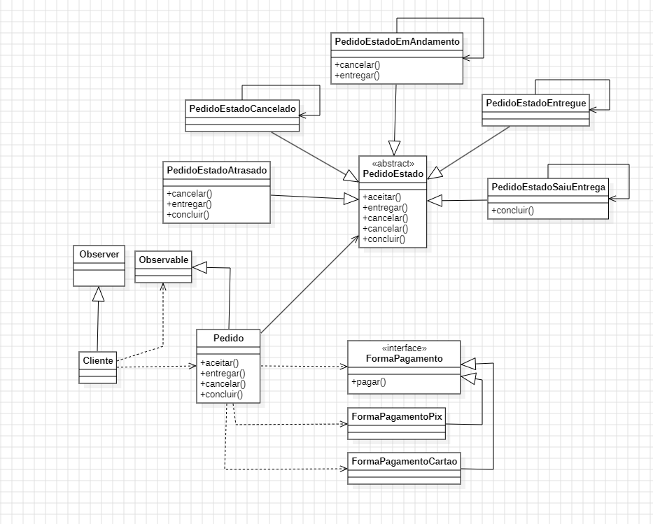
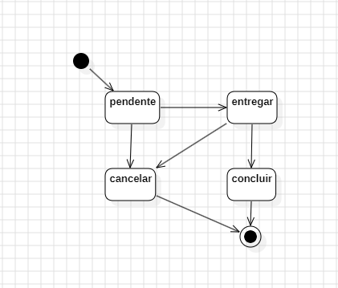

# Serviço de Entrega — Aplicação de Padrões de Projeto  
Repositório: **serviço-entrega-padrões**  
📦 Pasta principal: `/src`

---

  

---

## 🎯 Visão Geral  
Este projeto implementa um serviço de entrega utilizando **padrões de projeto**. A ideia é separar responsabilidades, organizar bem a arquitetura e tornar o código mais manutenível e testável.

## ✅ Como Executar  
1. Verifique se você tem Java 21 (versão especificada no `pom.xml`).  
2. Execute `mvn clean install` para compilar e rodar testes.  
3. Execute a aplicação (por exemplo, `mvn spring-boot:run` ou o método `main` conforme projeto).  
4. Use o endpoint REST ou serviço conforme documentação adicional para testar funcionalidades.

## 🔍 Por que “padrões de projeto”?  
Padrões ajudam a isolar a lógica de persistência da lógica de negócio, promovendo desacoplamento. Utilizar esses padrões desde cedo no projeto facilita manutenção, escalabilidade e evolução.
